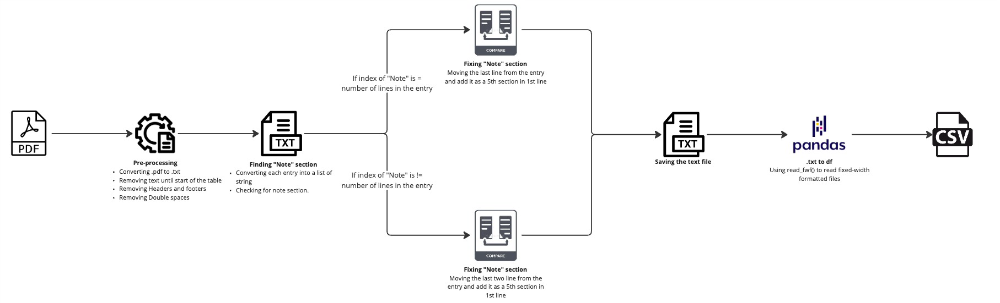
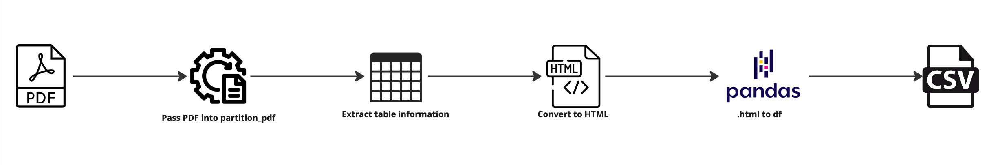
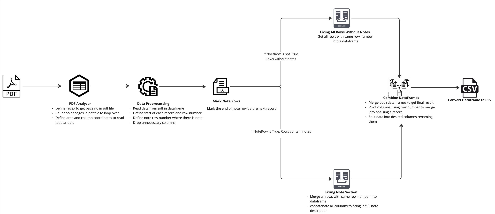

# README

## Project Overview

This project involves reading and processing a PDF document to extract specific information, transform it into a structured format, and save it as a text file. The aim is to convert a PDF containing details into a manageable data frame for further analysis.

## Requirements

- Python 3.10
- requirements.txt
- API KEY - https://unstructured.io/api-key-free

## Installation

Install the required libraries using the following command:

```sh
pip install -r requirements.txt
```

### Docker

- Pull the docker image: 

```sh
docker pull talibilat/orbitalwitnessassessment
```

- Run the docker image: 

```sh
docker run talibilat/orbitalwitnessassessment
```

NOTE : main.py file has 3 methods to solve the problem. Do not forget to comment other 2 methods before ruuning one. 

## Structure of the Code

The code is structured as follows:

```
ORBITALWITNESS/
├── Data/
│   └── Official_Copy_Register_EGL363613.pdf
├── Output/
├── Scripts/
│   └── Regex/
│       ├── dataframe_processor.py
│       ├── pdf_processor.py
│       └── text_processor.py
│   └── Unstructured/
│       ├── csv_saver.py
│       ├── html_processor.py
│       ├── json_convertor.py
│       ├── pdf_processor.py
│       └── unstructured_client_processor.py
│   └── Tabula/
│       ├── dataframe_processor.py
│       └── pdf_processor.py
├── main.py
├── Dockerfile
├── README.md
└── requirements.txt
```

## Main Script

`main.py` contains three methods:

1. **Method 1**: Extracts and processes text from a PDF using regex, converts it to a DataFrame, and saves the processed data to a CSV file.
2. **Method 2**: Uses the Unstructured Client to extract elements from a PDF, converts them to JSON, combines and pretty prints table HTML, and saves tables to a CSV file.
3. **Method 3**: Extracts tables from a PDF using Tabula, processes and cleans the combined data, and saves the final formatted schedule to a CSV file.

## Regex

- **dataframe_processor.py**: Initializes with a file path to load data into a DataFrame, finds indices of rows where a specified column is not NaN, and merges rows based on provided indices by concatenating non-NaN values.
- **pdf_processor.py**: Processes the PDF to extract text between 'title' and 'Title', cleans the extracted text, and formats it by removing double newlines.
- **text_processor.py**: Processes text data, splits it into lists, fixes the "NOTE" column by merging lines, converts the lists back into formatted text, and saves the processed text to a file.

## Unstructured

- **csv_saver.py**: A static method that takes a list of HTML tables, converts them to DataFrames, concatenates these DataFrames into one, and saves the combined DataFrame as a CSV file.
- **html_processor.py**: Combines HTML tables from elements into a single HTML document and pretty prints the given HTML content.
- **json_convertor.py**: Converts a list of elements (each with a `to_dict()` method) to a JSON formatted string with pretty printing.
- **pdf_processor.py**: Initializes with a PDF file path and extracts elements from the PDF using the `partition_pdf` function.
- **unstructured_client_processor.py**: Initializes with an API key for authentication, extracts elements from a specified file using UnstructuredClient, sets request parameters, handles potential SDK errors, and converts response elements into a usable format.

## Tabula

- **dataframe_processor.py**: Combines DataFrames, cleans and preprocesses the combined data, removes rows after a pattern, concatenates selected columns, processes 'NOTE' rows, and formats the final schedule by merging and organizing data.
- **pdf_processor.py**: Initializes with a PDF file and counts the number of pages using a regex pattern to find all occurrences of page markers in the file.


# Pros and Cons of Each Method for Extracting Tables from PDFs

### Approach 1: Using Regex and pandas

**Pros:**
- **Simplicity:** Easier to implement as it converts the PDF to text and processes the text using inbuild python libraries.
- **Speed:** Generally faster processing compared to more complex methods.
- **Lower Development Cost:** Requires less time and resources to develop.

**Cons:**
- **Less Precision:** Text conversion may lose formatting and data structure, leading to potential inaccuracies.
- **Limited to Simple PDFs:** Not suitable for complex PDFs with intricate layouts.
- **Additional Cleaning Needed:** May require more cleaning to handle issues like double spaces and headers/footers.




### Approach 2: Using Unstructured Library

**Pros:**
- **Automation:** Uses specialized libraries for automatic table extraction.
- **Accuracy:** Extracts tables directly, maintaining the structure and formatting.
- **Yolo Integration:** Leverages computer vision to extract tables with 3 different modes. "hi-res - for best resolution", "ocr-only - if we only want OCR", "fast - less accurate but really fast"

**Cons:**
- **High Development Cost:** Requires integrating multiple specialized libraries.
- **Processing Intensive:** Can be slower and more resource-intensive, especially for large PDFs.
- **Complex Setup:** More complex setup and maintenance compared to simpler methods.





### Approach 3: Using Tabula

**Pros:**
- **Customizable:** Allows for precise control over data extraction using regex and defined areas.
- **Handles Complex PDFs:** Can manage multi-page PDFs and different sections like notes effectively.
- **Detailed Processing:** Ensures that unnecessary data is removed, and relevant data is clearly defined.

**Cons:**
- **Complexity:** Requires detailed configuration and preprocessing steps.
- **Development Time:** More time-consuming to develop due to the need for custom scripts.
- **Processing Overhead:** Can be resource-intensive, especially for large PDFs.




### Overall Comparison

1. **Ease of Use:**
   - Approach 1: Easier, simpler text conversion.
   - Approach 2: Moderate, requires some coding.
   - Approach 3: Moderate, requires some coding.

2. **Accuracy:**
   - Approach 1: Moderate, potential loss of structure.
   - Approach 2: High, maintains table structure.
   - Approach 3: High, with custom extraction.

3. **Development Time:**
   - Approach 1: Low, simpler method.
   - Approach 2: High, complex integration.
   - Approach 3: High, detailed setup.

4. **Processing Time:**
   - Approach 1: Moderate.
   - Approach 2: High, resource-intensive.
   - Approach 3: Can be high.

5. **Flexibility:**
   - Approach 1: Low.
   - Approach 2: High, handles complex tables.
   - Approach 3: High, customizable.


## Future/Ongoing Approach

- I have started building with building a RAG model to test the qulaity of outputs for RAG used cases using LlamaIndex, Lanchain, Ollama with open and closed source models